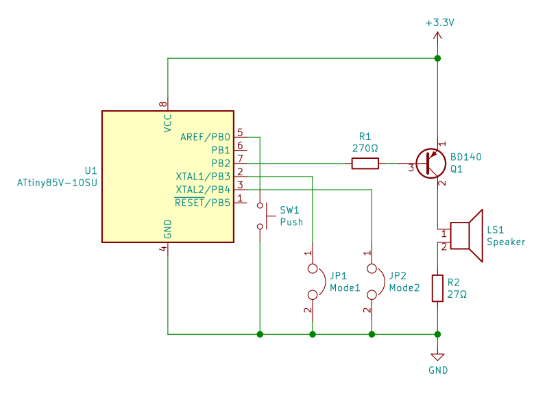

# Klaxon

A very small project aiming to recreate the famous sound of french firemen and
policemen, for kids passionnated by big trucks and real superheros :-)

A loudspeaker and a small chip is enough. Hardware schematic is in kicad
folder, and software code is in arduino folder.

Resources folder is not part of this project.
